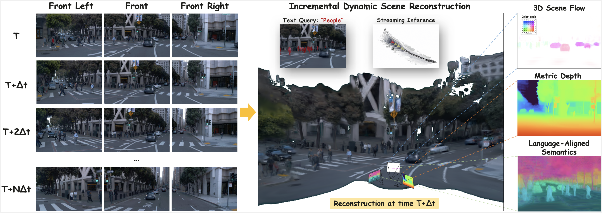

<h1>
  SLARM: Streaming and Language-Aligned Reconstruction Model for Dynamic Scenes
</h1>

This repository will contain the official implementation of SLARM, a feed-forward model that unifies dynamic scene reconstruction, semantic understanding, and real-time streaming inference.

## 📢 News
> **[2026-02]** 🎉 SLARM has been accepted to CVPR 2026! Code coming soon!
