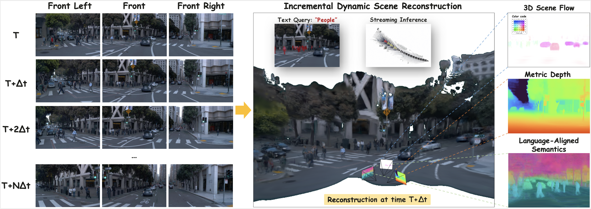

<div align="center">

<h1>
  SLARM: Streaming and Language-Aligned Reconstruction Model for Dynamic Scenes
</h1>

<a href="https://arxiv.org/abs/2603.22893"></a>
<a href='https://kevinchiu19.github.io/SLARM/'></a>

</div>

<div align="center">



</div>


This repository will contain the official implementation of SLARM, a feed-forward model that unifies dynamic scene reconstruction, semantic understanding, and real-time streaming inference.

## 📢 News
- **[2026-06]** 🎉 Training and evaluation code of SLARM is available now!
- **[2026-04]** 🎉 SLARM has been selected as a highlight paper!
- **[2026-02]** 🎉 SLARM has been accepted to CVPR 2026! Code coming soon!

---

## Highlights
* **Fast, feed-forward, streaming inference, and self-supervised** dynamic scene reconstruction from sparse multi-view sequences.
* Learns **3D Gaussian** *and* **scene flow** jointly; supports real-time rendering (once Gaussians are generated) and semantic segmentation.
* SLARM achieves **state-of-the-art** results in dynamic estimation, rendering quality, and scene parsing, improving motion accuracy by **21%**, reconstruction PSNR by **1.6 dB**, and segmentation mIoU by **20%** over existing methods.

---

## Installation
> Tested with **PyTorch 2.1.0** and an Ascend **910C(A3)**
> Tested with **CUDA 12.1**, **PyTorch 2.3.1** and an NVIDIA **A100/H800**  (Replace the CUDA/PyTorch versions as needed for your environment)

```bash
# create conda environment
conda create -n SLARM python=3.10 -y
conda activate SLARM

# ======================================== for Ascend NPU ========================================
# Install PyTorch
pip install torch==2.1.0 torchvision==0.16.0 torchaudio==2.1.0

# Install torch-npu
# Choose the correct torch_npu version based on the corresponding torch and cann versions.
# ref: https://gitcode.com/Ascend/pytorch
# cat /usr/local/Ascend/ascend-toolkit/latest/aarch64-linux/ascend_toolkit_install.info
# e.g.: version=8.2.RC1
pip install torch-npu==2.1.0.post13

# Optional: Differentiable Voxelization
pip install torch-scatter==2.0.9

# Install meta_gauss_render, specific versions supported by torch 2.1.0 and Ascend 910C(A3)
You can refer to our 3DGS code specifically adapted for the Ascend hardware, and then build from source. https://gitcode.com/cann/cann-recipes-spatial-intelligence/blob/master/algorithms/gaussian_splatting/README.md

# Install python dependencies
pip install -r requirements_npu.txt

# Install CLIP for semantic alignment
pip install git+https://github.com/openai/CLIP.git

# ======================================== for NVIDIA GPU ========================================
# Install mamba for faster installation
conda install mamba -n base -c conda-forge

# Optional: When gsplat compilation fails due to g++ version or CUDA toolkit issues.
# Install CUDA 12.1 in conda environment
mamba install nvidia/label/cuda-12.1.1::cuda-toolkit -c nvidia/label/cuda-12.1.1
# export CUDA_HOME=$CONDA_PREFIX

# Install PyTorch with CUDA 12.1
pip install torch==2.3.1 torchvision==0.18.1 torchaudio==2.3.1 --index-url https://download.pytorch.org/whl/cu121

# Optional: Differentiable Voxelization
pip install torch-scatter -f https://data.pyg.org/whl/torch-2.3.1+cu121.html

# Install gsplat, specific versions supported by torch 2.3.1 and cuda 12.1
pip install git+https://github.com/nerfstudio-project/gsplat.git@937e29912570c372bed6747a5c9bf85fed877bae --no-build-isolation

# Install python dependencies
pip install -r requirements.txt

# Install CLIP for semantic alignment
pip install git+https://github.com/openai/CLIP.git

```

## Dataset Preparation

### Waymo Dataset
- To prepare the Waymo Open Dataset, please refer to [Waymo Data](docs/WAYMO.md)
- We provide a tiny subset of Waymo Open Dataset (1 sequences) for quick experimentation: [SLARM_data_demo](https://drive.google.com/file/d/1Dsh0nUXsLdFBllkq8EVC1xQoclOq7KeL/view?usp=drive_link)

## Checkpoints

To enable the Lseg distillation, download the model weights provided by [Lseg official model](https://drive.google.com/file/d/1FTuHY1xPUkM-5gaDtMfgCl3D0gR89WV7/view?usp=sharing), place to `ckpts/demo_e200.ckpt`, then run `PYTHONPATH=$(pwd) python tools/convert_lseg_model.py` to generate the new weights we need.

Due to company policy reasons, it is not convenient to share the pre-trained model weights at the moment. You should be able to reproduce the results of the paper using the provided code. Please feel free to contact me if you have any questions.


## Inference

```bash
#!/bin/bash


# Select platform
export DEVICE_TYPE="NPU"  # GPU or NPU

if [ "$DEVICE_TYPE" = "GPU" ]; then
    # run single-GPU inference demo
    export CUDA_VISIBLE_DEVICES=5  # 0,1,2,4,5,6,7
    export TORCH_DISTRIBUTED_DEBUG=DETAIL
    export NCCL_DEBUG=INFO
    export NCCL_P2P_DISABLE=0
    export NCCL_P2P_LEVEL=NVL
fi

if [ "$DEVICE_TYPE" = "NPU" ]; then
    export DEVICE_TYPE="NPU"
    export ASCEND_RT_VISIBLE_DEVICES=13  # 0,1,2,4,5,6,7
    # NPU performance optimization
    export AVOID_AI_CPU=1  # Avoid generating AI_CPU Sin and Cos operators due to double data type.
    export USE_EQUAL_CROSS=1  # Equivalent replacement for torch.cross
    export TASK_QUEUE_ENABLE=2  # Speed ​​up host distribution
    export PYTORCH_NPU_ALLOC_CONF=expandable_segments:True  # Start virtual memory to save device memory
    export CONTEXT_FEAT=1  # No feature is rendered; feature is only supervised from the input viewpoint.
    export RENDER_OP_VERSION=1212  # Rendering operator version
    # export RENDER_PROJ_FWD_USE_FUSED_KERNEL=1  # Rendering projection uses the blending operator for forward propagation, and annotations use the small operator.

    # NPU Debugging and Logging
    # export ASCEND_SLOG_PRINT_TO_STDOUT=1
    # export ASCEND_GLOBAL_LOG_LEVEL=3
    # export ASCEND_LAUNCH_BLOCKING=1  # for debug

    # Replace the rendering preprocessing script in the container environment
    bash replace_meta_gauss_render.sh ${CONDA_DEFAULT_ENV} ${RENDER_OP_VERSION}
fi

# Set model configuration
export FEAT_DIST=1
export DATASET=waymo
export DATA_ROOT=data/SLARM_data
# export OVERFIT_EXP=1
# export SCENE_ID_WAYMO=525
# export PROFILING=1  # Printing takes time

export MASTER_PORT=16818
export DEVICE_NUM=1
export BS_PER_DEVICE=1
export PROJECT=slarm
export EXP_NAME=exp_0527

export SCENE_ID=525
export SCENE_START_INDEX=0
export SCENE_END_INDEX=15
export CKPT_PTH=xxx.pth


# python -m debugpy --listen 13688 --wait-for-client inference.py \
torchrun --nproc_per_node=$DEVICE_NUM --master_port ${MASTER_PORT} inference.py \
    --project ${PROJECT} \
    --exp_name ${EXP_NAME} \
    --dataset ${DATASET} \
    --data_root $DATA_ROOT \
    --model slarm \
    --load_depth --load_flow --load_ground \
    --num_max_cameras 3 --use_affine_token \
    --sigmoid_rgb \
    --num_motion_tokens 0 \
    --use_sky_token \
    --embed_dim 768 --depth 12 --patch_embed conv --patch_size 8 \
    --use_ms3_motion \
    --use_last_token \
    --shortcut_rgb \
    --add_patch_plucker_embed \
    --similarity_probs_threshold 0.2 \
    --online_feat --img_norm_for_online_feat \
    --lseg_model_scratch_path ckpts/lseg/lseg_model_scratch.pth --lseg_model_pretrained_path ckpts/lseg/lseg_model_pretrained_replace_1x1conv_with_linear.pth \
    --scene_id $SCENE_ID --scene_start_index $SCENE_START_INDEX --scene_end_index $SCENE_END_INDEX \
    --save_rendered_pc --rendered_pc_save_path "output_rendered_pc_${SCENE_ID}_${SCENE_START_INDEX}_${SCENE_END_INDEX}" \
    --save_gaussian --gaussian_save_path "output_gs_${SCENE_ID}_${SCENE_START_INDEX}_${SCENE_END_INDEX}" \
    --load_from $CKPT_PTH
```
> **Tips:**
> - `CKPT_PTH` refers to the checkpoint. e.g.: xxx.pth
> - `SCENE_ID` refers to the scene id in training sets.  e.g.: 365
> - `SCENE_START_INDEX` refers to the starting frame in the entire clip. e.g.: 0
> - `SCENE_END_INDEX` refers to the ending frame in the entire clip. e.g.: 180
> - To switch to streaming (online) mode, you can use the parameter `--mode window_3` and then switch `inference.py` to `inference_stream.py`.


## Training & Evaluation

Multi-GPU example that reproduces the paper's SLARM model:

```bash
#!/bin/bash


# Select platform
export DEVICE_TYPE="NPU"  # GPU or NPU

if [ "$DEVICE_TYPE" = "GPU" ]; then
    # run single-GPU inference demo
    export CUDA_VISIBLE_DEVICES=5  # 0,1,2,4,5,6,7
    export TORCH_DISTRIBUTED_DEBUG=DETAIL
    export NCCL_DEBUG=INFO
    export NCCL_P2P_DISABLE=0
    export NCCL_P2P_LEVEL=NVL
fi

if [ "$DEVICE_TYPE" = "NPU" ]; then
    export DEVICE_TYPE="NPU"
    export ASCEND_RT_VISIBLE_DEVICES=13  # 0,1,2,4,5,6,7
    # NPU performance optimization
    export AVOID_AI_CPU=1  # Avoid generating AI_CPU Sin and Cos operators due to double data type.
    export USE_EQUAL_CROSS=1  # Equivalent replacement for torch.cross
    export TASK_QUEUE_ENABLE=2  # Speed ​​up host distribution
    export PYTORCH_NPU_ALLOC_CONF=expandable_segments:True  # Start virtual memory to save device memory
    export CONTEXT_FEAT=1  # No feature is rendered; feature is only supervised from the input viewpoint.
    export RENDER_OP_VERSION=1212  # Rendering operator version
    # export RENDER_PROJ_FWD_USE_FUSED_KERNEL=1  # Rendering projection uses the blending operator for forward propagation, and annotations use the small operator.

    # NPU Debugging and Logging
    # export ASCEND_SLOG_PRINT_TO_STDOUT=1
    # export ASCEND_GLOBAL_LOG_LEVEL=3
    # export ASCEND_LAUNCH_BLOCKING=1  # for debug

    # Replace the rendering preprocessing script in the container environment
    bash replace_meta_gauss_render.sh ${CONDA_DEFAULT_ENV} ${RENDER_OP_VERSION}
fi

# Set model configuration
export FEAT_DIST=1
export DATASET=waymo
export DATA_ROOT=data/SLARM_data
export OVERFIT_EXP=1
export SCENE_ID_WAYMO=525
# export PROFILING=1  # Printing takes time

export MASTER_PORT=16818
export DEVICE_NUM=1
export BS_PER_DEVICE=1
export PROJECT=slarm
export EXP_NAME=exp_0527
# export CKPT_PTH=xxx.pth


# python -m debugpy --listen 13688 --wait-for-client main_slarm.py \
torchrun --nproc_per_node=$DEVICE_NUM --master_port ${MASTER_PORT} main_slarm.py \
    --project ${PROJECT} \
    --exp_name ${EXP_NAME} \
    --dataset ${DATASET} \
    --data_root $DATA_ROOT \
    --batch_size $BS_PER_DEVICE --num_iterations 200000 --lr_sched constant \
    --vis_every_n_iters 500 \
    --eval_every_n_iters 10000 --keep_n_ckpts 30 --ckpt_every_n_iters 10000 \
    --enable_tensorboard \
    --model slarm \
    --load_depth --load_flow --load_ground \
    --load_semantic_label \
    --num_max_cameras 3 --use_affine_token \
    --sigmoid_rgb \
    --num_motion_tokens 0 \
    --use_sky_token \
    --embed_dim 768 --depth 12 --patch_embed conv --patch_size 8 \
    --use_ms3_motion \
    --use_last_token \
    --shortcut_rgb \
    --add_patch_plucker_embed \
    --enable_depth_loss --enable_sky_opacity_loss \
    --enable_flow_reg_loss --flow_reg_coeff 0.005 \
    --enable_perceptual_loss --perceptual_weight 0.05 --perceptual_loss_start_iter 5000 \
    --rgb_loss_coeff 1.0 \
    --similarity_probs_threshold 0.2 \
    --online_feat --img_norm_for_online_feat \
    $( [ "$DEVICE_TYPE" = "GPU" ] && echo "--enable_feat_loss" ) \
    $( [ "$DEVICE_TYPE" = "NPU" ] && echo "--enable_context_feat_loss" ) \
    --feat_loss_coeff 1.0 --feat_loss_type mse \
    --lseg_model_scratch_path ckpts/lseg/lseg_model_scratch.pth --lseg_model_pretrained_path ckpts/lseg/lseg_model_pretrained_replace_1x1conv_with_linear.pth \
    --auto_resume
```

> **Tips:**
> - Checkpoints and logs are saved at `work_dirs/<project>/<exp_name>`
> - `batch_size` is per-GPU; global batch = batch_size × #GPUs × #nodes
> - For additional arguments, see `main_slarm.py`
> - To switch to streaming (online) mode, you can use the parameter `--mode window_3` and then select appropriate weights from the offline model as initialization using the `--load_from $CKPT_PTH` parameter
> - To enable semantic label loss (for finetune), you can use `--feat_loss_type cls_prob`
> - To enable the evaluation mode, you can modify `--auto_resume` to `--load_from $CKPT_PTH` & `--evaluate`


## Visualization

```bash
# 3dgs viewer: (ply are saved from inference by using '--save_gaussian' config)
python tools/gs_viewer.py \
    --dir /path/to/your/plyfile_dir

# pointcloud viewer: (ply are saved from inference by using '--save_rendered_pc' config)
python tools/pc_viewer.py \
    --dir /path/to/your/plyfile_dir \
    --fix_view \
    --port 8080 \
    --different_color

# pointcloud viewer with camera pose:
# multi pose_file：
python tools/pc_viewer_campose.py \
    --ply_path /path/to/your/pointcloud.ply \
    --pose_load_mode multi --num_max_cameras 3 --num_step_ply 1 --ply_type type2 \
    --history_point_lightness 0.3 --fix_view --server_port 8080 \
    --sliding_window_sleep 0.5 --mode manual --screenshots_dir dir/to/save/screenshots_image
# single pose_file：
python tools/pc_viewer_campose.py \
    --ply_path /path/to/your/pointcloud.ply --pose_load_mode single --pose_file /path/to/your/camera_pose.txt \
    --num_max_cameras 6 --num_step_ply 10 --ply_type type2 \
    --history_point_lightness 0.3 --fix_view --server_port 8080 \
    --sliding_window_sleep 0.5 --mode manual --screenshots_dir dir/to/save/screenshots_image
```

## Citation

```bibtex
@InProceedings{Qiu_2026_CVPR,
    author    = {Qiu, Zhicheng and Meng, Jiarui and Luo, Tong-an and Huang, Yican and Feng, Xuan and Li, Xuanfu and Xu, Zhan},
    title     = {SLARM: Streaming and Language-Aligned Reconstruction Model for Dynamic Scenes},
    booktitle = {Proceedings of the IEEE/CVF Conference on Computer Vision and Pattern Recognition (CVPR)},
    month     = {June},
    year      = {2026},
    pages     = {29023-29034}
}
```

## Acknowledgements

Our implementation builds upon **gsplat**, **GaussianSTORM**, **4DGT**.
We thank the respective authors for open‑sourcing their excellent work.
